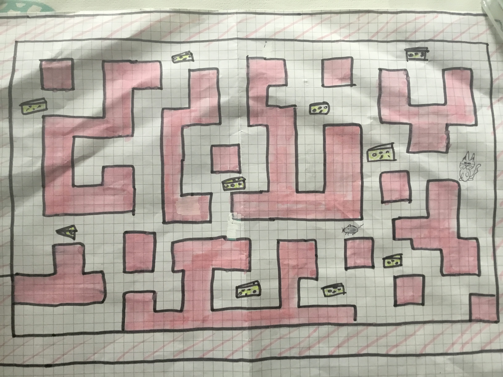
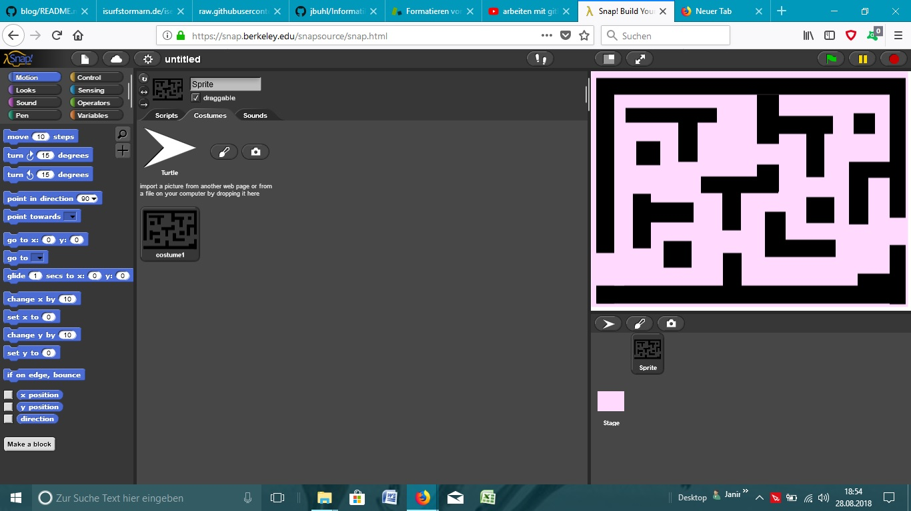

# blog
von Jarolin

### Erste Informatikstunde: 21.08.2018 

In der ersten Doppelstunde haben wir als erstes einen Account bei GitHub erstellt und versucht uns in die Funktionen des Programmes hineinzufinden. 
Wir beide hatten bis zu dem Zeitpunkt keinerlei Erfahrungen mit dem Programmieren und auf den ersten Blick wirkte es sehr komplex.
Durch Ausprobieren haben wir mit dem Programm "The Beauty and Joy of Computing" mit Snap! erste kleine Aktionen durchgeführt und verschiedene Funktionen entdeckt.
Es folgt ein Screenshot als Beispiel unserer Erfahrungen der ersten Stunde.
Schon nach kurzer Zeit begann es Spaß zu bringen.

 .png)

### Zweite Informatikstunde: 27.08.2018

Heute haben wir weiterhin versucht, uns mit dem Programm "Snap!" vertraut zu machen. Ebenfalls haben wir uns über andere Programme wie Greenefoot informiert und danach den Versuch von letzter Stunde wiederaufgenommen, den Screenshot in den Blog einzufügen. Am Ende der Stunde haben wir das Bild in den Ordner oben eingefügt, direkt daraufhin hat es geklingelt und die Stunde war vorbei.

### Dritte Informatikstunde: 28.08.2018

In der dritten Stunde haben wir uns Gedanken über unser erstes Projekt gemacht. Wir haben entschieden, es mit "Snap!" zu programmieren, da wir uns damit am besten auskennen. Unser zweiter Entschluss war es, ein Spiel zu erstellen, bei dem zwei Spieler gleichzeitig spielen können. Dazu unser erster, nicht digital erstellter Gedanke:

 

 

Diesen haben wir dann virtuell umgesetzt:

### Vierte Informatikstunde: 10.09.2018

Da in der vergangenen Woche der Informatikunterricht ausgefallen ist, haben wir uns zu Hause weiterhin mit dem Programm "Snap!" auseinandergesetzt. Wir haben uns dazu einige Tutorials auf YouTube angesehen und versucht, mehr Verständnis von den einzelnen Schritten des Programmierens zu bekommen. Außerdem haben wir uns Gedanken über unser eigenes Projekt gemacht. Da wir vorher noch nie etwas programmiert haben, habe.n wir beschlossen, als erstes Projekt ein Spiel zu entwickeln. Ein weiterer Grund für diese Wahl ist, dass wir in unserem Alltag eigene Erfahruzngen mit Computer- oder Handyspielen machen und uns daher gut vorstellen können, wie das Endprodukt aussehen könnte.
Heute haben wir es endlich geschafft, die Bilder einzufügen. :grinning:
 
