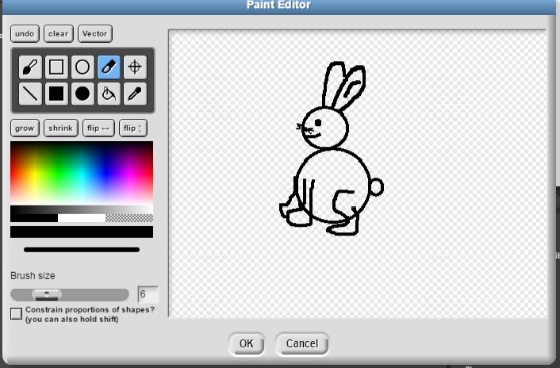

# Blog
von Jarolin

### Erste Informatikstunde: 21.08.2018 

In der ersten Doppelstunde haben wir als erstes einen Account bei GitHub erstellt und versucht uns in die Funktionen des Programmes hineinzufinden. 
Wir beide hatten bis zu dem Zeitpunkt keinerlei Erfahrungen mit dem Programmieren und auf den ersten Blick wirkte es sehr komplex.
Durch Ausprobieren haben wir mit dem Programm "The Beauty and Joy of Computing" mit Snap! erste kleine Aktionen durchgeführt und verschiedene Funktionen entdeckt.
Es folgt ein Screenshot als Beispiel unserer Erfahrungen der ersten Stunde.
Schon nach kurzer Zeit begann es Spaß zu bringen.

 .png)

### Zweite Informatikstunde: 27.08.2018

Heute haben wir weiterhin versucht, uns mit dem Programm "Snap!" vertraut zu machen. 
Ebenfalls haben wir uns über andere Programme wie Greenefoot informiert und danach den Versuch von letzter Stunde wiederaufgenommen, den Screenshot in den Blog einzufügen. 
Am Ende der Stunde haben wir das Bild in den Ordner oben eingefügt, direkt daraufhin hat es geklingelt und die Stunde war vorbei.

### Dritte Informatikstunde: 28.08.2018

In der dritten Stunde haben wir uns Gedanken über unser erstes Projekt gemacht. Wir haben entschieden, es mit "Snap!" zu programmieren, da wir uns damit am besten auskennen. 
Unser zweiter Entschluss war es, ein Spiel zu erstellen, bei dem zwei Spieler gleichzeitig spielen können. Dazu unser erster, nicht digital erstellter Gedanke:

 

 

Diesen haben wir dann virtuell umgesetzt:

### Vierte Informatikstunde: 10.09.2018

Da in der vergangenen Woche der Informatikunterricht ausgefallen ist, haben wir uns zu Hause weiterhin mit dem Programm "Snap!" auseinandergesetzt. 
Wir haben uns dazu einige Tutorials auf YouTube angesehen und versucht, mehr Verständnis von den einzelnen Schritten des Programmierens zu bekommen. 
Außerdem haben wir uns Gedanken über unser eigenes Projekt gemacht. 
Da wir vorher noch nie etwas programmiert haben, haben wir beschlossen, als erstes Projekt ein Spiel zu entwickeln. 
Ein weiterer Grund für diese Wahl ist, dass wir in unserem Alltag eigene Erfahrungen mit Computer- oder Handyspielen machen und uns daher gut vorstellen können, wie das Endprodukt aussehen könnte.

Unsere Idee von letzter Stunde (das Spiel mit dem Labyrinth) haben wir leider verworfen. Der Grund dafür ist, dass wir die Wände des Labyrinths nicht so programmieren können, dass die Maus und die Katze, die die Charaktere wahrscheinlich dargestellt hätten, nicht durch die Wände laufen können.

In der heutigen Stunde haben wir ein Brainstorming über mögliche Alternativen zu unserer ursprünglichen Idee gemacht und diese anschließend diskutiert.
In einer Überarbeitung des Blogs und der Neustrukturierung unserer GitHub Seite haben wir es endlich geschafft, die bereits früher gemachten Bilder einzufügen. :grinning:
Außerdem haben wir durch einen fremden GitHub-User herausgefunden, wie man Emojis einbauen kann. :thumbsup: 

### Fünfte Informatikstunde: 11.09.2018

Heute haben wir eine neue Idee für das Projekt besprochen und beschlossen, diese auch umzusetzen. 
Es handelt sich um ein Spiel, bei dem der Protagonist ein rosa Hase ist. 

Dieser startet am unteren rand des Bildschirmes und kann sich in alle vier Richtungen bewegen.
Er versucht in verschiedenen Leveln automatisch von links nach rechts fliegenden roten Kugeln auszuweichen, und dabei auf alle in dem Level vorhandenen Möhrchen zu treffen.

Geschieht dies, unterbricht das Spiel und es wird dem Spieler eine Multiple-Choice frage mit verschiedenen Antwortmöglichkeitren gestellt.

Diese Frage hat wahrscheinlich etwas mit einem Thema aus der Biologie zu tun, deshalb auch die Wahl des Hasen. 
Wir persönlich finden es sehr wichtig, dass Spiele auch einen Lerneffekt haben. 
Unser Ziel ist es durch das Spiel motorische Fähigkeiten, zum Beispiel Reaktionsschnelligkeit, mit geistlicher Anstrengung zu verknüpfen.

Des Weiteren soll unser Spiel keine Zeitverschwendung für die Spieler sein, sondern ihr Wissen bereichern und Interessen für neue Themengebiete erwecken, außerdem kann es Freude beim Lernen für die Schule (Oberstufe?) bereiten. 
Wird eine Frage falsch beantwortet oder der Hase von den Kugeln getroffen beginnt das Spiel von Neuem.
Konnten ohne getroffen zu werden alle Möhren erreicht und die Fragen alle richtig beantwortet werden ist das Level bestanden.

Es folgt ein Screenshot von unserer ersten Skizze des Hasen und einer groben Skizze des gesamten Spiels, gezeichnet auf einem iPad.

Und hier ein Beispiel für unsere Möhre:

 

### Sechste Informatikstunde: 17.09.2018

Heute haben wir begonnen, unser Spiel zu programmieren. Erst haben wir eine passenden, erdigen Hintergrund aus Google Bilder (https://www.obi.de/ratgeber/garten-und-freizeit/gartenpflanzen/garten-basics/torffreie-erden/images/rindenhumus.jpg) ausgesucht und dann zwei rote Kugeln erstellt und so programmiert, dass sie sich selbstständig zeitlich und räumlich versetzt von links nach rechts hin und zurück bewegen. 

### Siebte Informatikstunde: 18.09.2018

Leider wurde unsere Arbeit von letzter Stunde nicht richtig gespeichert. Dies hatte zur Folge, dass wir den Hintergrund und die roten Kugeln neu erstellen programmieren mussten.

Desweiteren haben wir unseren hasen skizziert und programmiert, sodass dieser sich in ein trauriges Gesicht (im Bild in schwarz, noch schwer zu erkennen) verwandelt, sobald die roten Kugeln berührt werden. Danach haben wir einen neuen Hintergrund gesucht, da uns das Design vom anderen nicht so gut gefällt, da er zu dunkel ist und auch nicht zu den virtuellen Figuren passt.

Außerdem haben wir dem "Hasen" (rosa) mehr Steuerungsmöglichkeiten gegeben. Davon einige Eindrücke als Screenshots: 

### Achte Informatikstunde: 22.10.2018

Heute hatten wir unsere Programmierungen verfeinert und uns...??

### Neunte Informatikstunde: 23.10.2018

In dieser Stunde hatten wir nochmal unseren Hasen verbessert, allerdings ist das Programm mehrmals abgestürzt, und unsere Änderungen wurden leider nicht gespeichert. 
Daraufhin haben wir den einmzig weiteren freien Computer benutzen wollen, jedoch hatte dieser ebenfalls einen technischen Defekt und es war nicht möglich, dass wir uns anmelden.

Zufällig befand sich dieser Computer neben Julian und Benedict, welche uns ihr Projekt zeigten und Probe spielen ließen. 
Wir waren begeistert von dem Design des Spieles und von der Tatsache, dass m,an es direkt af dem Smartphone probieren konnte. Sie erzählten uns, dass sie 

### Zehnte Informatikstunde: 29.10.2018

Heute haben wir entschieden, ein neues Programm für unser Spiel auszuprobieren, und zwar "App Inventor". Wir haben uns dazu entschieden, da uns klar geworden ist, dass unser Fortschritt nicht proportional zu unserer Anstrengung wächst. Außerdem bietet das Programm nicht alle Funktionen, die wir für unser Spiel brauchen. Und da der Abgabetermin immer näher rückt, haben wir diesen doch etwas riskanten Schritt gewagt.

Das Spielprinzip wird gleich bleiben, nur ist jetzt unser Ziel, dass das Spiel auf dem Handy per Touch gespielt werden kann. Das heißt, der Hase wird mit einem Tippen um einen bestimmte Zahl den y-Wert ändern, sodass der Hase sich jedes Mal ein Stück nach oben bewegt. 

Wir haben uns mithilfe von anderen Schülern über das Programm informiert und versucht, uns direkt zurecht zu finden.Mittlerweile haben wir Fortschritte gemacht, aber dazu werden wir die Screenshots nächstes Mal hinzufügen, da die Stunde jetzt zuende ist.

### Elfte Informatikstunde: 30.10.2018

Heute haben wir, wie angekündigt, die Screenshots eingefügt. Zu sehen sind unser Hase, die Programmierungen in Form der Blocks und unser erster Ball, der noch hin und her fliegen soll: 

