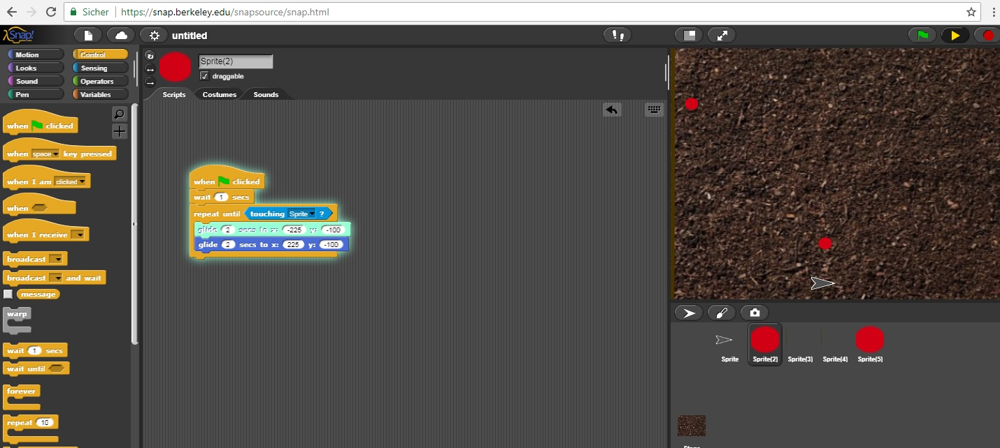
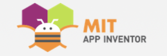
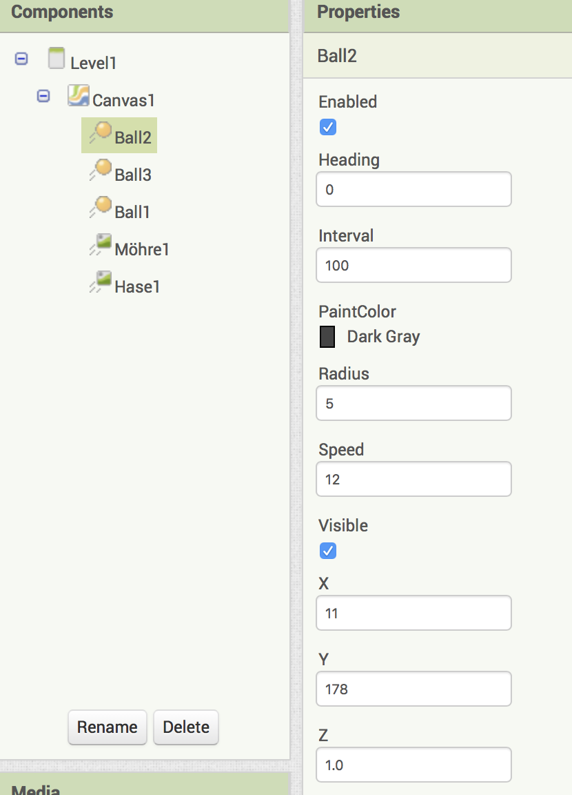
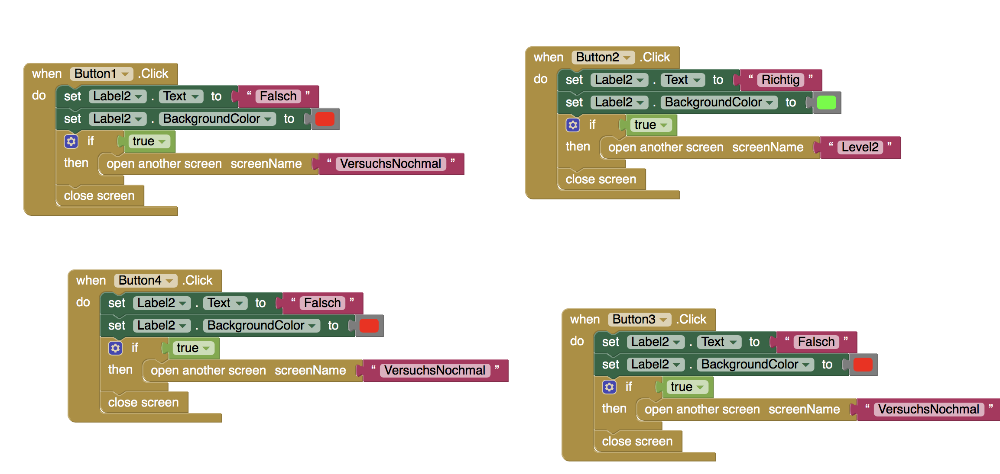
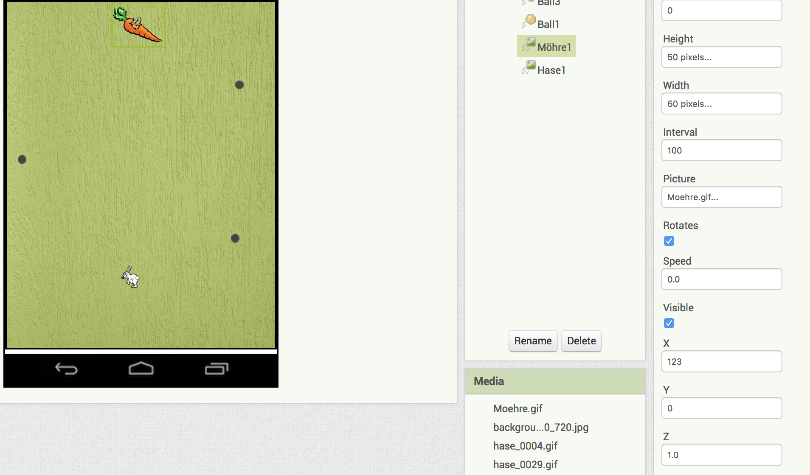
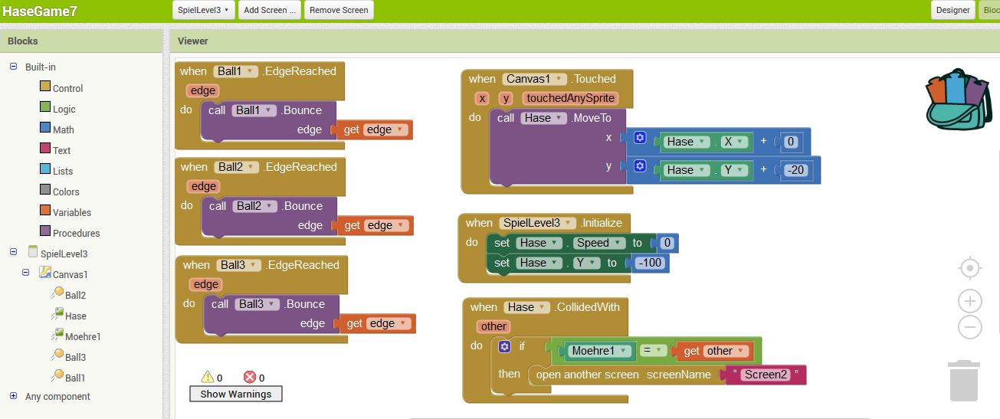
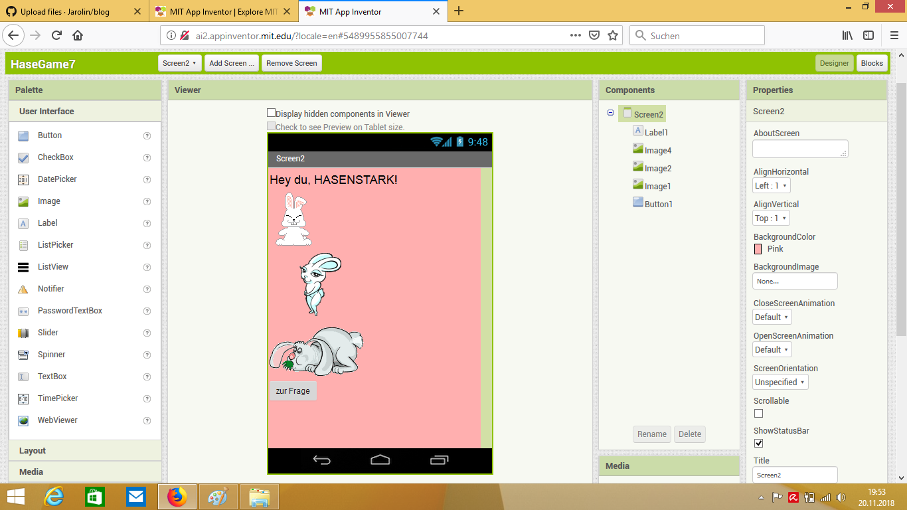
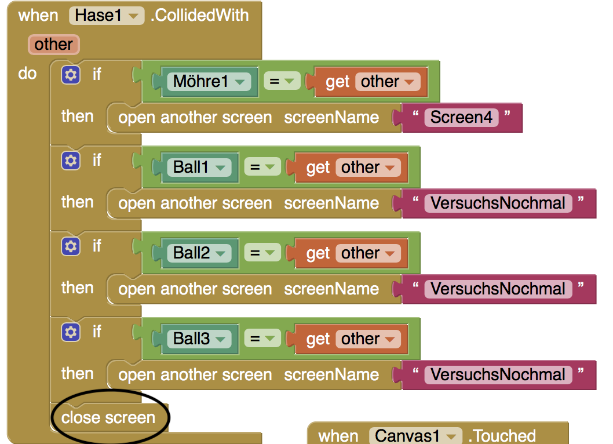

# Blog
von Carolin Oelschlägel und Janina Gräfnitz

### Erste Informatikstunde: 21.08.2018 

In der ersten Doppelstunde haben wir als erstes einen Account bei GitHub erstellt und versucht, uns in die Funktionen des Programmes hineinzufinden. 
Wir beide hatten bis zu dem Zeitpunkt keinerlei Erfahrungen mit dem Programmieren und auf den ersten Blick wirkte es sehr komplex.
Durch Ausprobieren haben wir mit dem Programm "The Beauty and Joy of Computing" mit Snap! erste kleine Aktionen durchgeführt und verschiedene Funktionen entdeckt.
Es folgt ein Screenshot als Beispiel unserer Erfahrungen der ersten Stunde.
Schon nach kurzer Zeit begann es Spaß zu bringen.

 .png)

### Zweite Informatikstunde: 27.08.2018

Wir haben zu Hause bereits den ersten Blogeintrag verfasst. 
In der heutigen Informatikstunde haben wir weiterhin versucht, uns mit dem Programm "Snap!" vertraut zu machen. 
Wir haben kleine Figuren gezeichent (Sprites erstellt) und uns die einzelnen Blöcke und ihre Befehle genauer angeschaut. 
Bei YouTube haben wir englische Tutorials gefunden, welche geanuer erklärten, wie das Pogramm funktioniert. 

Ebenfalls haben wir uns über andere Programme wie Greenfoot informiert und es hinbekommen, Screenshots in GitHub einzufügen.
Jedoch konnten wir sie leider noch nicht im Blog erscheinen lassen.
Viel zu schnell hat es bereits geklingelt und die Stunde war vorbei.

### Dritte Informatikstunde: 28.08.2018

In der dritten Stunde haben wir uns Gedanken über unser erstes Projekt gemacht. Wir haben entschieden, es mit "Snap!" zu programmieren, da wir uns damit am besten auskennen. 
Unser zweiter Entschluss war es, bestenfalls ein Spiel zu erstellen, bei dem zwei Spieler gleichzeitig spielen können. Dazu unser erster, nicht digital erstellter Gedanke:

 

 

Diesen haben wir dann virtuell umgesetzt:

### Vierte Informatikstunde: 10.09.2018

Da in der vergangenen Woche der Informatikunterricht ausgefallen ist, haben wir uns zu Hause weiterhin mit dem Programm "Snap!" auseinandergesetzt. 
Wir haben uns dazu einige Tutorials auf YouTube angesehen und versucht, mehr Verständnis von den einzelnen Schritten des Programmierens zu bekommen. 
Außerdem haben wir uns Gedanken über unser eigenes Projekt gemacht. 
Da wir vorher noch nie etwas programmiert haben, haben wir beschlossen, als erstes Projekt auf jeden Fall ein Spiel zu entwickeln. 
Ein weiterer Grund für diese Wahl ist, dass wir in unserem Alltag eigene Erfahrungen mit Computer- oder Handyspielen machen und uns daher gut vorstellen können, wie das Endprodukt aussehen könnte.

Unsere Idee von letzter Stunde (das Spiel mit dem Labyrinth) haben wir leider verworfen. 
Der Grund dafür ist, dass wir die Wände des Labyrinths nicht so programmieren können, dass die Maus und die Katze, die die Charaktere wahrscheinlich dargestellt hätten, stets an den Wänden vorbeilaufen.

In der heutigen Stunde haben wir ein Brainstorming über mögliche Alternativen zu unserer ursprünglichen Idee gemacht und diese anschließend diskutiert.
In einer Überarbeitung des Blogs und der Neustrukturierung unserer GitHub Seite haben wir es endlich geschafft, die bereits früher gemachten Screenshots und Bilder einzufügen. :grinning:
Außerdem haben wir durch einen fremden GitHub-User herausgefunden, wie man Emojis einbauen kann. :thumbsup: 

### Fünfte Informatikstunde: 11.09.2018

Heute haben wir eine neue Idee für das Projekt besprochen und beschlossen, diese auch umzusetzen. 
Es handelt sich um ein Spiel, bei dem der Protagonist ein rosa Hase ist. 

Dieser startet am unteren rand des Bildschirmes und kann sich in alle vier Richtungen bewegen.
Er versucht in verschiedenen Leveln automatisch von links nach rechts fliegenden roten Kugeln auszuweichen, und dabei auf alle in dem Level vorhandenen Möhrchen zu treffen.

Geschieht dies, unterbricht das Spiel und es wird dem Spieler eine Multiple-Choice frage mit verschiedenen Antwortmöglichkeitren gestellt.

Diese Frage hat wahrscheinlich etwas mit einem Thema aus der Biologie zu tun, deshalb auch die Wahl des Hasen. 
Wir persönlich finden es sehr wichtig, dass Spiele auch einen Lerneffekt haben. 
Unser Ziel ist es durch das Spiel motorische Fähigkeiten, zum Beispiel Reaktionsschnelligkeit, mit geistlicher Anstrengung zu verknüpfen.

Des Weiteren soll unser Spiel keine Zeitverschwendung für die Spieler sein, sondern ihr Wissen bereichern und Interessen für neue Themengebiete erwecken, außerdem kann es Freude beim Lernen für die Schule (Oberstufe?) bereiten. 
Wird eine Frage falsch beantwortet oder der Hase von den Kugeln getroffen beginnt das Spiel von Neuem.
Konnten ohne getroffen zu werden alle Möhren erreicht und die Fragen alle richtig beantwortet werden ist das Level bestanden.

Es folgt ein Screenshot von unserer ersten Skizze des Hasen und einer groben Skizze des gesamten Spiels, gezeichnet auf einem iPad.

Und hier ein Beispiel für unsere Möhre:

 

### Sechste Informatikstunde: 17.09.2018

Heute haben wir begonnen, unser Spiel zu programmieren. Erst haben wir eine passenden, erdigen Hintergrund aus Google Bilder (https://www.obi.de/ratgeber/garten-und-freizeit/gartenpflanzen/garten-basics/torffreie-erden/images/rindenhumus.jpg) ausgesucht und dann zwei rote Kugeln erstellt und so programmiert, dass sie sich selbstständig zeitlich und räumlich versetzt von links nach rechts hin und zurück bewegen. 

### Siebte Informatikstunde: 18.09.2018

Leider wurde unsere Arbeit von letzter Stunde nicht richtig gespeichert. Dies hatte zur Folge, dass wir den Hintergrund und die roten Kugeln neu erstellen programmieren mussten.

Des Weiteren haben wir unseren Hasen skizziert und programmiert, sodass dieser sich in ein trauriges Gesicht (im Bild in schwarz, noch schwer zu erkennen) verwandelt, sobald die roten Kugeln berührt werden. 
Danach haben wir einen neuen Hintergrund gesucht, da uns das Design von dem anderen nicht so gut gefällt.
Dieser ist zu dunkel und passt auch farblcih nicht gut zu den virtuellen Figuren.

Außerdem haben wir dem "Hasen" (rosa) mehr Steuerungsmöglichkeiten gegeben. Davon einige Eindrücke als Screenshots: 

### Achte Informatikstunde: 22.10.2018

Heute hatten wir unsere Programmierungen verfeinert. Außerdem haben wir uns erste Gedanken darüber gemacht, wie das mit dem Biologie-Quiz Teil programmiert werden könnte.
Wir haben auf meherern Tutorial Seiten im Internet nach Lösungen gesucht, jedoch wurden wir dabei nicht wirklich fündig.
Uns wurde klar, dass unser Wusch mit dem gewählten Programm "Snap!" womöglich etwas schwierig umzusetzen wird.

Leider kam uns keine Alternatividee.
Wir beschlossen, dass wir die Quizfragen eventuell weglassen müssen.
Dies fanden wir allerdigs sehr schade, da sie unser Spiel unserer Meinung nach besonders gemacht hätten. 
Denn ein Spiel, welches zwei Teile (den Hasenteil und den Quizteil) miteinander vereint, haben wir beide bisher noch nirgendwo gespielt. 

### Neunte Informatikstunde: 23.10.2018

In dieser Stunde war Carolin alleine, da Janina aufgrund von Krankheit ausgefallen ist.  
Sie hat nochmal unseren Hasen verbessert, allerdings ist das Programm mehrmals abgestürzt, die Änderungen wurden leider nicht gespeichert. 
Dies war ziemlich frustrierend. 
Daraufhin hat sie den einzig weiteren freien Computer benutzen wollen, jedoch hatte dieser ebenfalls einen technischen Defekt und es war nicht möglich sich anzumelden.

Zufällig befand sich dieser Computer neben Julian und Benedict, welche Carolin ihr Projekt zeigten und sie Probe spielen ließen. 
Sie war begeistert von dem Design des Spieles und von der Tatsache, dass man es direkt af dem Smartphone probieren konnte. Sie erzählten, dass sie ihr Spiel mit dem Programm "MIT App Inventor" programmierten. 

Ebenfalls berichteten sie von der Funktion, dass man zwischen verschiedenen Screens wechseln kann. So fällt es leicht einen seperaten Quizteil zu erstellen.

Carolin war begeistert von dem Programm und erzählte Janina direkt davon.

### Zehnte Informatikstunde: 29.10.2018

Heute haben wir entschieden, ein neues Programm für unser Spiel auszuprobieren, und zwar "MIT App Inventor". 

Wir haben uns dazu entschieden, da uns klar geworden ist, dass unser Fortschritt nicht proportional zu unserer Anstrengung wächst. Außerdem bietet das alte Programm nicht alle Funktionen, die wir für unser Spiel brauchen. 
Und da der Abgabetermin immer näher rückt, haben wir diesen doch etwas riskanten Schritt gewagt.

Das Spielprinzip wird gleich bleiben, nur ist jetzt unser Ziel, dass das Spiel auf dem Handy per Touch gespielt werden kann. Das heißt, der Hase wird mit einem Tippen um einen bestimmte Zahl den y-Wert ändern, sodass der Hase sich jedes Mal ein Stück nach oben bewegt. 

Wir haben uns mit Hilfe von anderen Schülern über das Programm informiert und versucht, uns direkt zurecht zu finden. Mittlerweile haben wir Fortschritte gemacht, aber dazu werden wir die Screenshots nächstes Mal hinzufügen, da die Stunde jetzt zu Ende ist.

### Elfte Informatikstunde: 30.10.2018

Heute haben wir, wie angekündigt, die Screenshots eingefügt. Zu sehen sind unser Hase, die Programmierungen in Form der Blocks und unser erster Ball, der noch hin und her fliegen soll: 

Wir haben bemerkt, dass die Befehle in dem neuen Programm sich glücklicherweise nicht sehr stark von denen in "Snap!" unterscheiden, so war das eingewöhnen relativ einfach.
Wir haben begonnen unsere Spielidee gezielt umzusetzen.

### Zwölfte Informatikstunde 06.11.2018

In der Zwischenzeit haben wir uns zu Hause durch das Ansehen einiger Tutorials näher mit dem Programm App Inventor beschäftigt. Unser besonderes Anliegen war herauszufinden, wie man eine Art Quizspiel auf einem neuen Screen einbauen kann. Dies haben wir nun verstanden und wollen es baldmöglichst umsetzen.

Außerdem haben wir uns zu Hause bereits Gedanken über mögliche Quizfragen und Antworten gemacht.
Wie bereits an früherer Stelle erwähnt, wollen wirn in dem Quiz Fragen zum Them,a Biologie stellen, die App soll Spaß und lernen miteinander verbinden. 
Wir denken, dass so eine App vielen Schülern gefallen würde, da wir selber wissen, dass die Motivation zum Lernen oft nicht da ist.

In der heutigen Informatikstunde war Janina leider krank und Carolin somit alleine anwesend und hat die Bälle programmiert.

Außerdem hat sie das Layout mit den richtigen Designblöcken für eine erste Quizfrage erstellt und dazu anschlöießend die nötigen Buttons programmiert. Somit ist es bereits zu diesem Zeitpunkt möglich eine der vier Antwortmöglichkeiten auszuwählen, man bekommt angezeigt ob es richtig oder falsch ist und bei Richtigkeit wird zu einem neuen Screen übergeleitet, auf dem man das Spiel neu starten kann. 

### Dreizehnte Informatikstunde 12.11.2018

In der heutigen Informatikstunde haben wir die Programmierung von letzer Woche optimiert. 
Außerdem haben wir eine Möhre als Zielpunkt korrekt ins Design integriert, bei Berühren von ihr erfolgt nun eine korrekte Überleitung zu einem weiteren Screen. 

Nun müsste einmal das komplette Durchspielen des Spiels möglich sein, was wir aufgrund des Stundenendes allerdings nicht mehr ausprobieren konnten.

### Vierzehnte Informatikstunde 13.11.2018

Da Janina heute bei dem Woodbridge-Austausch teilnimmt und sich somit in England befindet, hat Carolin an der Gestaltung der GitHub Seite weitergearbeitet. Außerdem hat sie mit der Projektseite begonnen.

Des Weiteren konnte das bisher programmierte Spiel auf dem Smartphone ausprobiert werden. Einige Funktionen haben bereits funktioniert, jedoch wurde schnell klar, dass noch einige wichtige Schritte fehlen.

Während des Austausches hat sich Janina bereits Gedanken über die genaue Strukturierung des Spiels gemacht. 
Da es mit den verschiedenen Screens während des Arbeitens etwas unübersichtlich wurde, hat sie einen genauen Plan mit den benötigten Screens erstellt.
Außerdem hat Janina an der Projektseite weitergearbeitet.

Da die App ein Screen Limit hat, haben wir uns darüber verständigt, dass wir drei unterschiedlich schwierige Level erstellen wollen.

Zwei davon hatten wir bereits, wir passten den Schwierigkeitsgrad durch Vergrößern der Bälle an und erstellten ein drittes Level.

### Fünfzehnte Informatikstunde 20.11.2018

Gestern ist leider die Informatikstunde ausgefallen und heute hatten wir aufgrund von Lehrerkonferenzen nur eine Stunde Zeit. Trotzdem haben wir heute durch weitere Arbeit von Zuhause aus viel geschafft.

Wir haben uns das Spiel noch detaillierter ausgedacht und strukturiert: Es gibt ebenfalls drei verschiedene Fragen aus dem Fachbereich Biologie, welche wir uns mit den Antwortmöglichkeiten überlegt haben. Sie werden im Verlauf der verschiedenen Levels schwieriger. 
Außerdem haben wir Screens hinzugefügt und unwichtige Elemente gelöscht. Zum Zweiteren gehören z. B. die Screens, die die Levels nachher darstellen sollen, also wo der Hase die Möhre erreichen soll. 

Hier einige Eindrücke zum jetzigen Stand:

Heute haben wir festgestellt, dass der Wechsel zu "MIT App Inventor" die richtige Entscheidung war, auch wenn wir kleine Startprobleme mit dem Programm hatten. Denn die Umsetzung und die Grafiken sind sehr viel anschaulicher und wir haben mehr Möglichkeiten. Allerdings ist die Screenanzahl wie bereits erwähnt begrenzt, weshalb wir einige nicht so wichtige Komponenten löschen mussten, wie zum Beispiel den Screen oben (s. Bild oben).

Des Weiteren haben wir an der projektseite weitergearbeitet.

### Vor der Abgabe

Am Wochenende vor der Projekt-Abgabe haben wir noch einmal viel an dem Projekt gearbeitet. 
Da wir das Spiel nur mit einem Smartphone ausprobieren können, auf dem Android läuft, hatten wir nur selten die Chance das Programmierte direkt auszuprobieren. 

Als wir dachten komplett fertig zu sein und alles korrekt programmiert zu haben, mussten wir beim Ausprobieren leider feststellen, dass noch ein paar kleine Fehler in der Programmierung enthalten waren. Diese haben das Speil aber stark beeinträchtigt, weswegen wir zunächst etwas geschockt waren.

Zum einen hatte die Möhre eine falsche Größe, der Hase ebenfalls. Mit verschiedenem Ausprobieren und dem Ändern der Pixelgröße der beiden ImageSprites konnten wir das Problem schließlich beheben. 
Im ersten Level flogen nur zwei der drei Kugeln korrekt, die dritte Kugel flog kreuz und quer. Diese mussten wir an dei Einstellungen der anderen beiden Kugeln anpassen. 

Ein Hauptproblem war, dass der Hase an der falschen Stelle startete, sodass er direkt die Möhre berührte. Leider konnte man in MIT App Inventor nicht das voreingestellte Koordinatensystem sehen. Somit mussten wir die Startkoordinaten des Hasen ständig verändern. Durch langsame Annährung konnten wir schließlich unseren Wunschstartwert für den Hasen einstellen.
Damit funktionierte das Speil soweit.

Beim Ausprobieren der verschiedenen Funktionen fiel uns anschließend auf, dass ab und zu, besonders bei einzelnen Antwortmöglichkeiten der Fragen, die Weiterleitung zu dem nächsten Screen falsch programmiert war.
Da wir manche Screens während des Arbeitsprozesses gelöscht und neu erstellt haben stand teilweise noch der alte Name des Screens in den Befehlen, welcher logischwerweise vom Programm nicht mehr gefunden werden konnte. Nach systematischem Durchgehen der einzelnen Screens konnten wir dieses Problem schließlich beheben.

Doch es trat ein weiteres Problem auf, bei dem Screen "VersuchsNochmal", auf den man gelangt, wenn der ImageSprite Hase einen Ball berührt oder der Spieler die Frage falsch beantwortet. 
Drückte man den Butten "Nochmal" startete das Speil erneut, doch stürzte kurze Zeit später wieder zu dem "VersuchsNochmal" Screen ab. Wir haben sehr lange gegrübelt woran deis liegen könnte. Schließlich kamen wir auf eine Idee. 
Unsere Befehle hießen überall "open another Screen". Jedoch hatten wir nicht bedacht, dass dadurch die anderen Screens im Hintergrund noch weiterliefen. Somit berührten die Bälle weiterhin den ImageSprite "Hase" und jedes Mal wenn das geschah, erschien wie programmiert der "VersuchsNochmal" Screen. 
Durch Einfügen des Befehls "close Screen" bei allen Blogs konnten wir dieses Problem beheben.

Auch wenn das nach vielen Fehlern klingt, waren es letztendlich alles nur kleine Änderungen. 

Endlich funktionierte das gesamte Spiel genau so, wie wir es uns vorgestellt hatten.
Obwohl das gesamte Projekt sehr viel Arbeit und manchmal auch ziemlich frustriend war (wenn bestimmte Dinge einfach nicht so funktioniert haben, wie man es wollte, oder man den Fehler nicht gefunden hat) überkam uns ein gewisser Stolz, als wir unser eigenes Spiel auf dem Smartphone komplett spielen konnten. 
Da wussten wir, dass sich die Mühe auf jeden Fall gelohnt hat.

Zusammenfassend kann man sagen, dass uns das Informatik Projekt super viel Spaß gebracht hat.
Jetzt, wo man sich mit dem Programmieren etwas auskennt, hat man große Lust an einem neuen Projekt zu arbeiten.
Ursprünglich waren wir etwas skeptisch gegenüber dem komplett unbekannten Programmieren, wir hätten wir niemals gedacht, dass wir so viel Freude an der Sache entwickeln würden.

Fürs nächste Mal nehmen wir uns vor, uns direkt auf ein Programm zu spezialisieren. Der relativ späte Wechsel von "Snap" zu "MIT App Inventor" war dennoch kein großes Problem, da die beiden Programme sehr ähnlich aufgebaut sind und wir einzelne Dinge und Kenntnisse einfach übernehmen konnten. 
Außerdem haben wir gelernt, dass es schwieriger als erwartet ist, wenn man die Dinge selber nicht ständig ausprobieren können, da keiner von uns ein Android- Handy besitzt.
Aus diesem Grund werden wir nächstes Mal wahrscheinlich auf ein anderes Programm wechseln, auch wenn mit MIT App Inventor am Ende sehr gut klargekommen sind. 

Wir hatten viel Spaß und freuen uns jetzt schon auf das nächste Projekt!! :)

